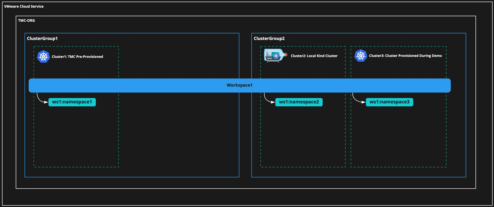

# Tanzu Mission Control Demo

## Demo Architecture and Description

This Demo shows the TMC key capabilities 



## Demo Preparation

1. Configure the env variables

```
export clustergroup1=mvp1
export cluster1=manhattan
export cluster2=harlem
export region=us-east-1
export keypair=tmc-key-pair
```

2. Deploy a new cluster using TMC CLI

```
tmc clustergroup create -n $clustergroup1"
tmc cluster create -n $cluster1 -r $region -g $clustergroup1 -s $keypair --dry-run > $cluster1.yaml"
tmc cluster create -f $cluster1.yaml
```

3. Access the cluster after its creation

```
tmc cluster provisionedcluster | grep $cluster1
tmc cluster provisionedcluster kubeconfig get $cluster1 >> ~/.kube/config
kubectx $cluster1
```

4. Create a Cluster Role Biding

```
kubectl create clusterrolebinding privileged-cluster-role-binding \
    --clusterrole=vmware-system-tmc-psp-privileged \
    --group=system:authenticated"
```

5. Deploy Contour

```
kubectl apply -f https://projectcontour.io/quickstart/contour.yaml"
```
6. Retrieve the external address of Contour’s Envoy load balancer and create a CNAME record that maps the host in your Ingress object to the ELB address

```
kubectl get -n projectcontour service envoy -o wide
```

7. Deploy an application to make sure it works

```
kubectl apply -f petclinic.yaml
kubectl get ingress
kubectl delete -f petclinic.yaml
```

8. Create a local kind cluster

```
kind create cluster --name $cluster2
kind export kubeconfig --name $cluster2
kubectx kind-$cluster2
```

9. Create a policy on $cluster2. This is going to be used to demonstrate how TMC preserves policies from attached clusters.

```
TBD
```


## How to run the demo

Before starting the Demo, make sure you have completed the previous step and have now two clusters to work with.

1. Clone this repo

2. Open the file `demo-script.sh` and update the environment variables:

```
export clustergroup1=mvp1
export clustergroup2=mvp2
export cluster1=manhattan
export cluster2=harlem
export cluster3=brooklyn
export region=us-east-1
export keypair=tmc-key-pair
export version="1.16.2-3-amazon2"
export devuser=<tmc-dev-user>
export workspace1=faas-fe # if you change this, make sure to change the image-policy and network-policy files as well
export namespace1=frontend
export namespace2=backend
export upgradeversion="1.16.7-1-amazon2"
```

3. Running the script

In a terminal run the script `demo-script.sh`

```
./demo-script.sh
```

We recommend running the demo showing both CLI and UI


## Demo Verbal script